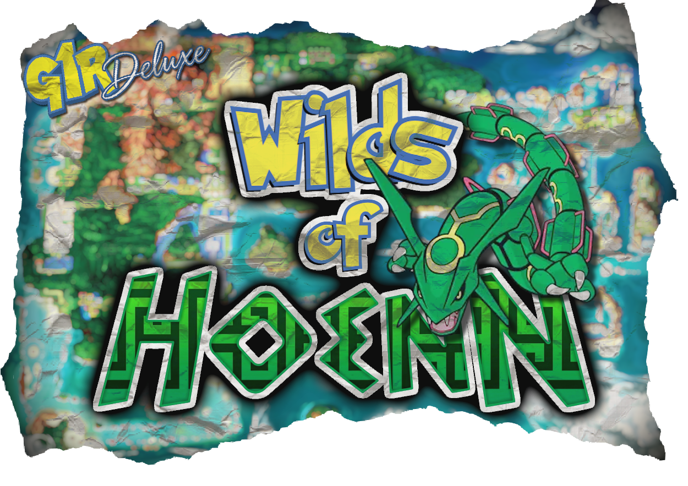

<p align="center">
  
</p>

# Wilds of Hoenn 🌿

**The tall grass is alive. Walk into the wilds, and bring a partner.**

## Quick Summary

Bring Hoenn and Kanto to life in [Gen1Recomp](https://github.com/bryanthaboi/gen1recomp)'s Generation 3 games: **Ruby, Sapphire, Emerald, FireRed and LeafGreen**.

- 🦌 **Pokémon in the overworld.** Wild Pokémon wander in the grass, in the water and in caves. Walk into one and you start the battle.
- 🤝 **Bring a partner.** Pick any Pokémon in your party menu and have it tag along for company, **forage** for items as you walk, or actively **battle** overworld Pokémon for you, like in Scarlet and Violet.
- 🫂 **Build friendship.** Face your follower and press A to pet it, play with it, or talk to it. Its portrait shows how it really feels, based on its HP, status and friendship.
- ✨ **Adjustable shiny rolls** for overworld encounters (gifts, eggs and starters are not affected).
- 🔗 **Works with dex expansion mods** such as [National Dex Gen 3](https://github.com/poooooby/national_dex_gen3) and [G9 Battle Sprites (Gen 3)](https://github.com/poooooby/g9-battle-sprites-gen3), so overworld encounters can reach all the way through Generation 9. Art is included for the whole National Dex (1-1025). Optional [Modern Spawns](https://github.com/poooooby/g1r_modern_spawns) integration too.
- 👾 Two sprite styles: **HGSS / PokeMMO** or fully animated **PMDCollab** sprites with walk, idle, attack and hurt animations.
- **+ much more on the way!**

### 💾 Installation

1. Download a release ZIP from the [Releases](https://github.com/poooooby/wilds-of-hoenn/releases) page and pick **one**:
   - **HGSS + PMDCollab** - the full experience (animated PMDCollab sprites, portraits, battle animations). About 58 MB. The PMDCollab art is licensed non-commercial (see [Third-party notices](#third-party-notices-and-credits)).
   - **HGSS Only** - a much smaller download, made for lower-power devices (Anbernic, older Android, etc.).
2. Import it with the Gen1Recomp Mod Manager (or drop it in your mods folder).
3. Enable **Wilds of Hoenn**. FireRed and LeafGreen support is newer and less play-tested than Ruby, Sapphire and Emerald, so please report anything odd.

## 📋 Options Summary

### Start Menu (the mod's options in the Mod Manager)

| Option | Choices | Default | What it does |
|---|---|---|---|
| **Show Wild Mons** | On / Off | On | Spawns visible wild Pokémon in areas with wild encounters. |
| **Sprite Style** | HGSS / PokeMMO, PMDCollab | PMDCollab | The look of wild Pokémon and your companion. PMDCollab has animated walk and idle loops; species without PMD art fall back to HGSS / PokeMMO. (PMDCollab is only in the HGSS + PMDCollab build.) |
| **Classic Enc** | On / Off | On | Keeps the original step-based random encounters in grass and water. Visible wild Pokémon stay active either way. Fishing and Rock Smash are unaffected. |
| **Silhouette** | Off / Undiscovered / All | Off | Draws visible wild Pokémon as black silhouettes: only species you haven't caught, or all of them. |
| **Shiny Rate** | Native, 1/4096, 1/2048, 1/1024, 1/500, 1/100, 1/10, All | Native | *Native* uses the game's real shiny chance. The other rates give visible wild Pokémon an extra roll at that chance, keeping their nature and gender. *All* makes every one shiny. Does not affect gifts, eggs or starters. |

### Pokémon Menu (party menu: select a Pokémon, then choose a job)

There is no Follower on/off option. The party leader follows until you choose someone else, and only one companion is out at a time.

| Menu row | What your Pokémon does |
|---|---|
| **FOLLOW** | Follows you. Face it and press A for **Pet** (a quick idle and its cry), **Play** (you throw a ball, it fetches it and spins) or **Talk** (it cries twice). Each one raises its friendship (Play +3, Pet +2, Talk +1), with limits so it can't be spammed. A hurt or sick Pokémon won't play and tells you why; petting a sick Pokémon has a 25% chance to cure it; talking shows how much it likes you. |
| **BATTLE** | When you stand still and a wild overworld Pokémon is within **3 tiles of you**, it charges in for a short fight with its **real moves, stats, damage and PP**. Health bars and hit effects appear on both, and it earns a little EXP for a win. The defeated Pokémon cries and sinks into the ground. A Battler is never knocked out: at 1 HP (or with no attack PP left) it runs back, cries and shrinks into you, and rests until it's healed. |
| **FORAGE** | While you **walk on routes and in caves** (not in towns, buildings, the Safari Zone or on water), it roams 5-10 tiles around you and runs back. Every 10-30 seconds it digs and has a **20% chance** to find an item for your bag (it cries to tell you when it does): healing and status items, Poké Balls, berries, evolution items (including National Dex Gen 3's extras) and cheap TMs. Never HMs, key items, Master Balls, Rare Candy or high-level TMs. |

## 🤓 Dev Information

```sh
# Copy Wilds of Kanto Revival's overworld art (run once, or after that repo
# updates its art); expects a sibling ../overworld-spawn-mod checkout. Not
# committed to this repo (see .gitignore) -- a fresh clone needs this before
# anything will actually draw a sprite.
python3 tools/copy_wilds_assets.py

# Optional: bake the PMDCollab sheets (needs a sibling ../SpriteCollab checkout)
python3 tools/generate_pmd_sprites.py

# Standalone unit tests (plain Lua, no engine needed)
for f in tests/*_unit_test.lua; do lua "$f" || echo "FAIL: $f"; done

# Link this repo into a sibling ../gen1recomp checkout's mods/
./scripts/bootstrap.sh

# Engine probe test + a ROM-free real-Loader boot test (luajit, run from
# inside the gen1recomp checkout)
cd ../gen1recomp
luajit mods/wilds_of_hoenn/tests/engine_patch_probe_test.lua
luajit mods/wilds_of_hoenn/tests/modkit_boot_test.lua
cd -

# Pre-release validation
python3 tools/validate_option_labels.py
python3 tools/validate_release_version.py

# .modkitignore lists every test / tool / script / doc by exact path (modkit has no
# wildcards) so none of them ships. After adding a file under tests/, tools/,
# scripts/ or docs/, regenerate it; the release build refuses to run while it's stale.
python3 tools/check_modkitignore.py --write

# Build the release ZIPs into release/: -hgss (HGSS / PokeMMO art only) and
# -hgss-pmd (+ PMDCollab). Sprites are baked into atlas shards first;
# --no-atlas for per-file sheets, --variant hgss|pmd for just one.
python3 scripts/build-mod.py --out-dir release
```

- **Manual test checklist:** [`docs/MANUAL_TEST.md`](docs/MANUAL_TEST.md). **Changelog:** [`CHANGELOG.md`](CHANGELOG.md).
- **Architecture:** start with the header comment of `lib/engine_patch.lua` (the only file that touches engine internals), then each module's own header in `lib/`. Tests mirror `lib/` one to one in `tests/`.

### How it works

Gen1Recomp's Gen 3 engine (`src/core/game3/`) has no mod seam yet for a visible overworld actor: `mod.world:spawnNpc` returns "not supported", `ow.entities` is a read-only snapshot, the field renderer has no draw hook, and collision has no mod hook ([RFC 0014](https://github.com/bryanthaboi/gen1recomp/blob/main/docs/rfcs/0014-mod-driven-actors-and-adopted-link-sessions.md) proposes one but it isn't implemented). This mod ships ahead of that, using the `engine_internals` permission to patch a handful of engine functions directly. `lib/engine_patch.lua` is the *only* file that does this and documents why each one is needed. The three that make the wild Pokémon work:

- `FieldEffects.collectActors` - draws our wild Pokémon alongside the player, NPCs and the follower.
- `Objects.blocks` - makes a wild Pokémon solid to NPCs, trainer sight and other wild Pokémon, while letting the player step onto one (a battle starts only once the player is standing on its tile).
- `Follower.update` - piggybacks our per-tick update onto the engine's existing follower tick.

The party menu's ROLE row (and its Follow / Forage / Fight submenu) adds three more: `PartyMenu.update`, `PartyMenu.handleInput` and `FieldMoves.fromMenu`, because the party menu has no mod hook for its action list. Every touch point is probed (`EnginePatch.probe()`) before it's patched, and `tests/engine_patch_probe_test.lua` runs the same probe against a real engine checkout. If a future Gen1Recomp update moves one, this mod disables itself and logs exactly what changed instead of crashing. Wild encounters themselves come from the engine's own rules (`Encounters.rules().rollSweetScent`); nothing about wild generation is reimplemented.

This mod is a sister project to [Wilds of Kanto Revival](https://github.com/poooooby/wilds-of-kanto-gen-3), built from scratch for Gen 3's different engine. It shares no runtime code or save data with it, only a read-only copy of its overworld art.

## 🤖 AI Disclosure

This mod was developed with help from [Claude Code](https://claude.com/claude-code) (Anthropic), working from direction, design decisions, in-game testing and bug reports from the maintainer, who also approves every release. AI-written code can contain mistakes, which is why the project ships a large unit-test suite, a real-engine probe test and a manual in-game checklist. If you find a bug, please open an issue here or on Discord.

## 🪪 Third-Party Notices and Credits

The mod's own code and tools are released under the [MIT License](LICENSE). The art it uses is **not** covered by that license:

- **HGSS / PokeMMO overworld sprites** - a read-only copy of [Wilds of Kanto Revival](https://github.com/poooooby/wilds-of-kanto-gen-3)'s sprite sources, made by many individual artists (full credits in [THIRD_PARTY_NOTICES.md](THIRD_PARTY_NOTICES.md) and that project's notices).
- **PMDCollab sprites and portraits** - from [PMDCollab/SpriteCollab](https://github.com/PMDCollab/SpriteCollab), licensed **CC BY-NC 4.0** (non-commercial); official-game graphics remain © Spike Chunsoft / Nintendo / The Pokémon Company. Per-species artist credits ship with the HGSS + PMDCollab release as `assets/pmd/CREDITS.txt`.
- **Code** adapted from Wilds of Kanto Revival (MIT) is listed in [THIRD_PARTY_NOTICES.md](THIRD_PARTY_NOTICES.md).

See [THIRD_PARTY_NOTICES.md](THIRD_PARTY_NOTICES.md) for every asset's credit and terms. Pokémon and its characters are trademarks of Nintendo, Game Freak and The Pokémon Company; this is an unofficial fan project and is not affiliated with them.
